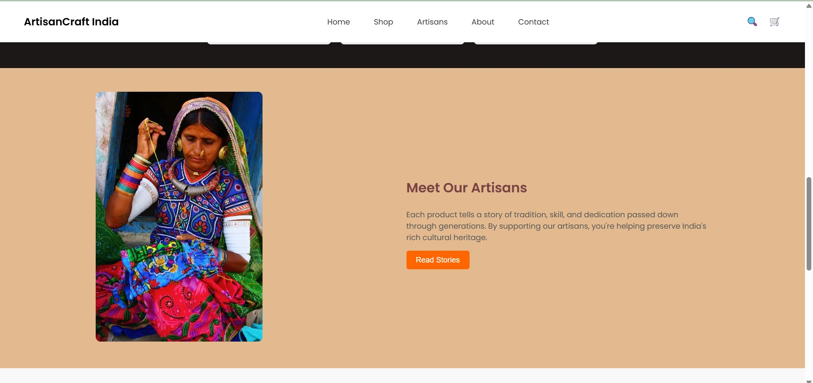
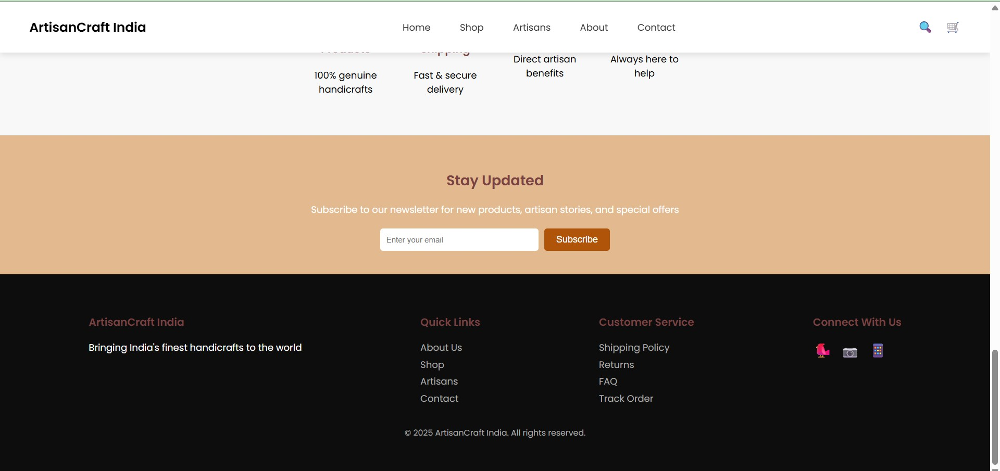
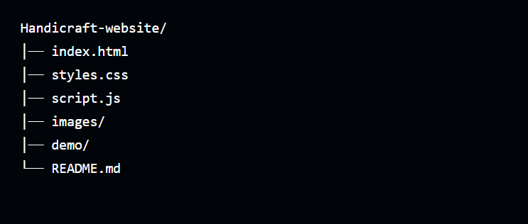

# 🧵 Handicraft Website  
A modern, elegant, and responsive handcrafted products website showcasing traditional artistry with a clean UI and smooth user experience.

✨ **HTML • CSS • JavaScript**  
🎨 **Fully Responsive • Modern Layout • Smooth UI**

---

## 🚀 Live Demo
👉 *Add your deployed link here*  
`https://your-demo-link.com`

---

## 🖼️ Preview (Screenshots)

### **Hero & Featured Products**
<table>
  <tr>
    <td></td>
    <td></td>
  </tr>
</table>

### **Why Choose Us & Stories Section**
<table>
  <tr>
    <td></td>
    <td></td>
  </tr>
</table>

### **Contact + Footer & Project Structure**
<table>
  <tr>
    <td></td>
  </tr>
</table>

---

## 🎯 Features
- ✔️ Fully responsive handcrafted UI  
- ✔️ Beautiful product showcase  
- ✔️ Clean navigation bar  
- ✔️ Smooth hover animations  
- ✔️ Pure HTML, CSS, JavaScript  
- ✔️ Lightweight and fast  

---

## 📁 Project Structure

<td></td>

---

## 🛠️ Tech Stack
| Technology | Purpose |
|-----------|----------|
| **HTML5** | Structure |
| **CSS3**  | Styling & responsive design |
| **JavaScript** | Interactivity |

---

## 📦 How to Run Locally
git clone https://github.com/MansiMore-0817/Handicraft-website

cd Handicraft-website

Right-click index.html → Open with Live Server

---

## 🤝 Contributing
Pull requests are welcome!  
Feel free to open an issue for feature suggestions or improvements.

---

## 📬 Connect With Me

Built by <b>Mansi More</b> • moremansi1707@gmail.com

